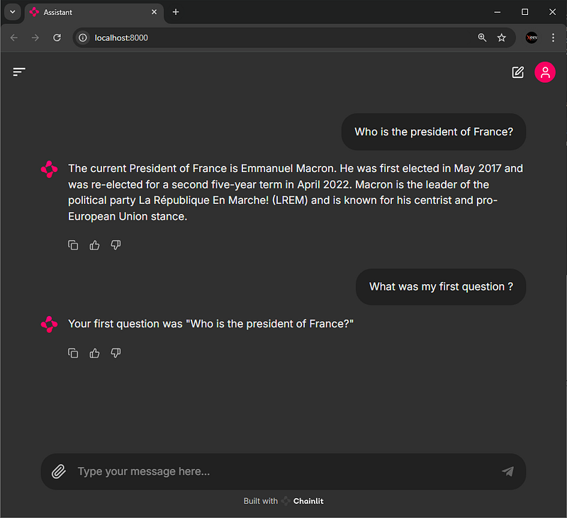

# The Odyssey of Your AI Companion – Part 1: The Birth of a New Era with AWS Bedrock and Chainlit
A Step-by-Step Guide to Creating and Growing Your AI Companion

<p align="center">
  
  <br>
  <i>Created with MidJourney</i>
</p>

Have you ever watched a superhero origin story? It always starts the same: a seemingly ordinary character suddenly gains incredible abilities. At first, they're unsure, clumsy, and even vulnerable. But as time goes on, with the proper guidance, they learn, grow, and eventually become something truly powerful - a hero capable of changing the world.

Imagine creating your own superhero - not a person, but an **AI companion**. One that begins as a newborn, learning and evolving with each new skill you teach it. That's precisely what we're about to embark on: the **Odyssey of your AI companion**.

**Together**, we'll guide it from its humble beginnings to its eventual transformation into a super-powered assistant that can handle anything you throw at it.

The best part? You don't need to be a seasoned developer to bring your companion to life. With tools like **UV, Chainlit**, and **AWS Bedrock**, this journey is accessible to everyone, step by step.

Are you ready to start your own superhero origin story? Let's dive in and begin this epic journey! 🚀

## Full Tutorial

Follow along on Medium as we take you through the step-by-step process of building your AI companion:

[Part 1:The Birth of a New Era with AWS Bedrock and Chainlit](https://generativeai.pub/the-odyssey-of-your-ai-companion-part-1-the-birth-of-a-new-era-with-aws-bedrock-and-chainlit-4cbb1d181b59)

## Installation guide


1. Clone the repository: https://github.com/rivaci/ai-companion-odissey.git
2. Navigate to the project directory ai-companion-odissey/part1-birth
3. Install dependencies

    > [NOTE]
    > It's always best practice and safe to create and activate a new python environment for every project.
    > In our case we use **python 3.12.3**.


    **With uv**

    ```
    uv pip install --system -r requirements.txt
    ```

    **With poetry**

    ```
    poetry init --no-interaction
    poetry add $(cat requirements.txt)
    ```

    **With conda**

    ```
    conda install --file requirements.txt
    ```

    **With pip**

    ```
    pip install -r requirements.txt
    ```

4. Create AWS Access Keys

    Follow the steps in the tutorial to configure an IAM user and get access keys. Store them in a [chatbot] profile in your .aws credentials file:

    **.aws/credentials**
    ```
    [chatbot]
    AWS_ACCESS_KEY_ID=your_access_key_id
    AWS_SECRET_ACCESS_KEY=your_secret_access_key
    ```
   
    **.aws/config**
    ```
    [chatbot]
    region = us-east-1
    output = json
    ```


5. Start the project

    ```
    uv run chainlit run chatbot.py -w
    ```

<p align="center">
  
  <br>
  <i>A browser tab will open whith our chatbot ready to answer our questions !</i>
</p>

## Contributing

We welcome contributions to this project! If you'd like to collaborate or share ideas for enhancements, don't hesitate to open an issue or submit a pull request.

## License

This project is open-source and licensed under the [MIT licence](../LICENSE).
