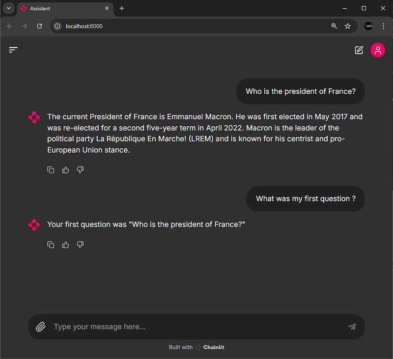

# The Odyssey of Your AI Companion - Part 2: Streaming and Observing with AWS Bedrock, Langsmith and Chainlit
A Step-by-Step Guide to Observing, Enhancing, and Empowering Your AI Companion

<p align="center">
  
  <br>
  <i>Created with MidJourney</i>
</p>

Every superhero's journey isn't just about gaining strength - it's about learning, adapting, and growing smarter with every challenge. 

After our AI companion took its [first steps in Part 1](https://github.com/rivaci/ai-companion-odissey/tree/main/part1-birth), it's time for us to enhance its abilities and closely monitor its behavior.

In this part of the Odyssey, we'll make our companion more responsive by introducing **streaming**, allowing it to deliver answers in real-time for a more dynamic interaction. 

At the same time, we'll learn to **observe** its progress using **Langsmith**, giving us the ability to track its performance and ensure continuous improvement.

But what exactly are we building? 

We're transforming our companion into a more engaging entity by adding **streaming capabilities** for lifelike, fluid conversations. Plus, with **Langsmith**, we'll be able to monitor and improve how our AI performs, making it smarter with every interaction!

<p align="center">
  
  <br>
  <i>What we build</i>
</p>

Let's dive in and continue shaping our AI companion into a smarter, more adaptable entity! 🚀

> **Disclaimer**: This tutorial builds on the concepts and tools introduced in Part 1: The Birth of a New Era with AWS Bedrock and Chainlit. If you haven't followed along yet, be sure to check it out first.

## Full Tutorial

Follow along on Medium as we take you through the step-by-step process of building your AI companion:

[Part 1:The Birth of a New Era with AWS Bedrock and Chainlit](https://generativeai.pub/the-odyssey-of-your-ai-companion-part-1-the-birth-of-a-new-era-with-aws-bedrock-and-chainlit-4cbb1d181b59)

## Installation guide


1. Clone the repository: https://github.com/rivaci/ai-companion-odissey.git
2. Navigate to the project directory ai-companion-odissey/part2-observing
3. Install dependencies

    > [NOTE]
    > It's always best practice and safe to create and activate a new python environment for every project.
    > In our case we use **python 3.12.3**.


    **With uv**

    ```
    uv pip install --system -r requirements.txt
    ```

    **With poetry**

    ```
    poetry init --no-interaction
    poetry add $(cat requirements.txt)
    ```

    **With conda**

    ```
    conda install --file requirements.txt
    ```

    **With pip**

    ```
    pip install -r requirements.txt
    ```

4. Create AWS Access Keys

    Follow the steps in the tutorial to configure an IAM user and get access keys. Store them in a [chatbot] profile in your .aws credentials file:

    **.aws/credentials**
    ```
    [chatbot]
    AWS_ACCESS_KEY_ID=your_access_key_id
    AWS_SECRET_ACCESS_KEY=your_secret_access_key
    ```
   
    **.aws/config**
    ```
    [chatbot]
    region = us-east-1
    output = json
    ```

5. Create your langsmith keys here and put them in a .env file at the root of the project

**.env**
    ```
    LANGCHAIN_TRACING_V2=true
    LANGCHAIN_API_KEY=our-langsmith-api-key
    LANGCHAIN_PROJECT=companion
    ```

6. Start the project

    ```
    uv run chainlit run chatbot.py -w
    ```

<p align="center">
  
  <br>
  <i>A browser tab will open whith our chatbot ready to answer our questions !</i>
</p>

## Contributing

We welcome contributions to this project! If you'd like to collaborate or share ideas for enhancements, don't hesitate to open an issue or submit a pull request.
